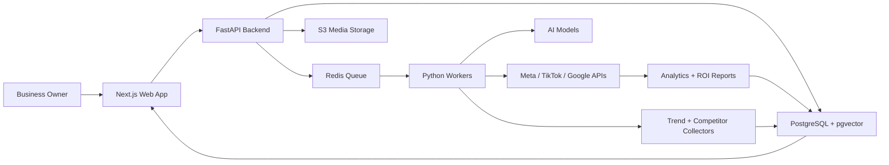

# CEO + CTO Plan For A Local Digital Marketing Agent

Date: 2026-06-05

## Executive Summary

We should build an AI marketing operator for local small businesses. The product helps owners turn one product, service, promotion, or video into platform-native marketing campaigns across Facebook, Instagram, TikTok, and Xiaohongshu/RED. The company should not compete head-on with ContentStudio, Buffer, or Hootsuite as a generic scheduler. The wedge is local-business growth: strategy, trend analysis, multilingual content adaptation, platform-native publishing workflows, and conversion feedback tied to actual customer demand.

The investor story:

> Local businesses do not need another dashboard. They need a marketing employee they can afford.

## CEO View

### Mission

Give every local small business an affordable AI marketing operator that plans, creates, adapts, publishes, and improves campaigns across global and Chinese-language social platforms.

### Target Customers

Primary launch customers:

1. Restaurants, cafes, dessert shops, and bubble tea shops.
2. Beauty businesses: nail salons, spas, med spas, hair salons, lash studios.
3. Real estate agents and local property teams.
4. Fitness studios, tutors, clinics, and professional services.
5. Businesses serving Chinese-speaking customers, international students, tourists, or Asian communities.

### Core Pain

Local business owners know they should post more, but they do not have time to understand every platform. A TikTok trend, an Instagram Reel, a Facebook community post, and a Xiaohongshu note all need different strategy. Existing tools schedule content, but they rarely tell the owner what to say, why it should work, and how it connects to sales.

### Market Position

| Alternative | Customer gets | Weakness |
| --- | --- | --- |
| ContentStudio / Buffer / Later | Scheduling, calendar, analytics, some AI text | Generic, dashboard-heavy, weak local-business strategy |
| Hootsuite / Sprout Social | Enterprise social management | Expensive and too complex for small businesses |
| Freelancers | Human content support | Variable quality, limited analytics, hard to scale |
| Agencies | Strategy, production, ads | Expensive retainers, slow iteration |
| DIY posting | Low cost | Inconsistent, no strategy, no learning loop |

Our position:

> The AI marketing operator built for local businesses, not social media managers.

### Irreplaceable Features

1. Platform-native campaign engine  
   One business input becomes four different strategies, not four copied captions.

2. Xiaohongshu-native growth module  
   Support Chinese copy, 种草 structure, searchable keywords, local Chinese consumer intent, KOL/KOC briefs, and compliance checks.

3. Local conversion loop  
   Connect content to calls, bookings, DMs, coupon redemptions, QR scans, Google Maps clicks, and walk-in intent.

4. Trend-to-action analyzer  
   Translate trends into specific actions: use, adapt, ignore, or avoid.

5. Owner approval workflow  
   The AI does the thinking and drafting; the owner approves, edits, or asks for a new direction.

6. Competitor intelligence for local markets  
   Track nearby businesses, content angles, offers, posting frequency, engagement patterns, and review sentiment.

### MVP Promise

In 10 minutes, a local business owner can upload a video or describe a promotion and receive a weekly campaign plan with ready-to-post versions for Instagram, TikTok, Facebook, and Xiaohongshu.

### Product Roadmap

#### Phase 1: Validation Landing Page + Concierge MVP

Goal: test demand before building full automation.

Build:

- Investor/customer landing page.
- Waitlist and demo request form.
- Manual/AI-assisted campaign generation for first users.
- Sample outputs for 3-5 industries.
- Simple dashboard mock showing weekly plan, platform strategy, and ROI loop.

Success signal:

- 50+ waitlist signups.
- 10+ discovery calls.
- 3-5 businesses willing to pay for pilot.

#### Phase 2: Product MVP

Build:

- Business onboarding profile.
- Content upload and campaign generation.
- Platform-native copy and video brief generation.
- Calendar and approval queue.
- Assisted publishing checklist.
- Basic analytics and conversion tracking.
- Admin dashboard for internal operations.

Success signal:

- Users generate campaigns weekly.
- At least 30% of users connect a measurable conversion action.
- Pilot customers report saved time and clearer strategy.

#### Phase 3: Automation + Integrations

Build:

- Meta publishing integration for Facebook/Instagram where API permissions allow.
- TikTok Direct Post or Upload-to-Draft integration where eligible.
- Google Business Profile posting if useful for local SEO.
- CRM/booking/coupon tracking integrations.
- Team approval workflow.
- Agency and multi-location accounts.

Success signal:

- Reduced manual support.
- Retention improves because weekly reporting proves business value.

#### Phase 4: Defensible Intelligence Layer

Build:

- Local trend database.
- Competitor benchmarking engine.
- Industry playbooks.
- Recommendation engine trained on campaign results.
- Xiaohongshu KOL/KOC discovery and brief workflow.

Success signal:

- Product recommendations become more accurate with more users and more campaign history.

### Pricing Strategy

| Plan | Price | Ideal user | Features |
| --- | --- | --- | --- |
| Starter | $49-$79/month | Owner-operated business | 20 AI campaign assets/month, 3 platforms, calendar, assisted publishing |
| Growth | $149-$249/month | Serious local marketer | 4 platforms, Xiaohongshu, trend analyzer, competitor watcher, replies, dashboard |
| Pro Local | $399-$699/month | High-value local business | AI plus human review, monthly strategy call, ad creative variants, conversion tracking |
| Agency / Franchise | $999+/month | Multi-location or agency | Role permissions, workspaces, approvals, white-label reports |

## CTO View

### Technical Strategy

Use Python for the backend because the product depends heavily on AI orchestration, data pipelines, platform APIs, trend analysis, and analytics. Use a modern TypeScript frontend for speed, investor polish, and long-term maintainability.

Recommended stack:

- Frontend: Next.js, React, TypeScript, Tailwind CSS, shadcn/ui, Framer Motion.
- Backend API: Python FastAPI.
- AI orchestration: Python services using OpenAI-compatible APIs, structured outputs, prompt templates, and retrieval.
- Database: PostgreSQL with pgvector for business profiles, playbooks, embeddings, and campaign memory.
- Cache/queues: Redis plus Celery or RQ for scheduled jobs, posting tasks, scraping jobs, analytics sync, and video processing.
- File/media storage: S3-compatible object storage.
- Auth: Clerk, Auth0, or Supabase Auth for fast launch.
- Payments: Stripe.
- Analytics: PostHog for product analytics; custom campaign analytics in PostgreSQL.
- Observability: Sentry, OpenTelemetry, structured logs.
- Deployment: Vercel for frontend; Render/Fly.io/AWS/GCP for backend; managed Postgres.

### Why This Stack

Python lets the team move quickly on AI, data extraction, trend classification, analytics, and platform API integrations. Next.js gives a polished investor-facing frontend and can later become the real product app. PostgreSQL keeps the MVP simple while supporting structured campaign data, customers, permissions, and vector search.

### High-Level Architecture

### Backend Services

1. Business Profile Service  
   Stores industry, location, audience, products, tone, languages, goals, and brand assets.

2. Campaign Generation Service  
   Converts one input into platform-native campaign assets.

3. Trend Analyzer Service  
   Collects and classifies platform trends by relevance, risk, timing, and adaptation strategy.

4. Competitor Intelligence Service  
   Tracks nearby competitors and similar businesses.

5. Publishing Service  
   Handles direct publishing where available and assisted publishing where restricted.

6. Analytics + Attribution Service  
   Tracks platform metrics plus calls, DMs, bookings, coupons, QR scans, and website clicks.

7. Compliance + Brand Safety Service  
   Flags risky claims, regulated-language issues, banned categories, platform policy risks, and overpromising.

### Platform Integration Notes

Facebook and Instagram:

- Use Meta APIs for supported business accounts.
- Expect app review, permissions, token refresh, media constraints, and possible limitations around Reels and account types.

TikTok:

- Use TikTok Content Posting API where eligible.
- Support direct post and upload-to-draft workflows.

Xiaohongshu:

- Treat as assisted publishing first.
- Generate final note copy, cover text, hashtags, keywords, location tags, and posting checklist.
- Later explore official ad/marketing APIs, 蒲公英/KOL workflows, and compliant partner routes.

### Data Model Outline

Core tables:

- users
- organizations
- locations
- social_accounts
- business_profiles
- products_services
- campaigns
- campaign_assets
- platform_variants
- publishing_tasks
- trend_signals
- competitor_profiles
- competitor_posts
- analytics_snapshots
- conversion_events
- approvals
- comments_and_replies

### MVP Build Order

1. Landing page and waitlist.
2. Business onboarding form.
3. Campaign generator with mocked platform publishing.
4. Campaign calendar and approval queue.
5. Assisted publishing export package.
6. Basic analytics dashboard.
7. Admin console for concierge operations.
8. Meta/TikTok integrations after validation.

### Engineering Risks

| Risk | Mitigation |
| --- | --- |
| Platform API restrictions | Start with assisted publishing and export packages |
| Xiaohongshu direct publishing limits | Build RED-native strategy and assisted posting first |
| AI outputs feel generic | Use business profile, local market data, examples, and feedback loops |
| Trend data access is unstable | Combine APIs, creator research, manual curation, and customer-specific performance |
| Attribution is hard | Start with coupon links, booking URLs, UTM links, call tracking, and QR codes |
| Small businesses churn quickly | Weekly ROI report and one-click next actions |

## Landing Page Strategy

### Hero Message

Headline:

> Your local business marketing team, powered by AI.

Supporting copy:

> Turn one video, menu item, service, or promotion into platform-native campaigns for TikTok, Instagram, Facebook, and Xiaohongshu.

Primary CTA:

> Join the pilot

Secondary CTA:

> See how it works

### Sections

1. Hero with live product preview.
2. Problem: local owners are expected to master every platform.
3. Solution: upload once, get a full weekly campaign.
4. Platform engine: different strategy for each channel.
5. Xiaohongshu advantage.
6. Trend analyzer and competitor watcher.
7. Local ROI loop.
8. Example weekly campaign for a restaurant or salon.
9. Pricing / pilot plans.
10. Investor-ready traction CTA: join pilot, request demo, or partner with us.

### Visual Direction Options

Option A: Operator Command Center  
Premium SaaS dashboard feel, dark charcoal base, crisp data panels, vibrant platform-color accents, animated campaign pipeline. Best for VC credibility.

Option B: Local Growth Studio  
Bright, friendly, owner-focused interface with warm photography, local storefront imagery, campaign cards, and approachable copy. Best for small-business customers.

Option C: Cross-Cultural Growth Engine  
Bold bilingual visual system, English + Chinese moments, Xiaohongshu/RED emphasis, map/local intent visuals, creator-commerce energy. Best if the strongest wedge is Chinese-speaking consumer acquisition.

## Recommended Next Move

Choose Option A for the first investor landing page. It gives the product a serious AI-SaaS feel while still showing local-business outcomes. The landing page should look like a working product preview, not a generic marketing brochure.

